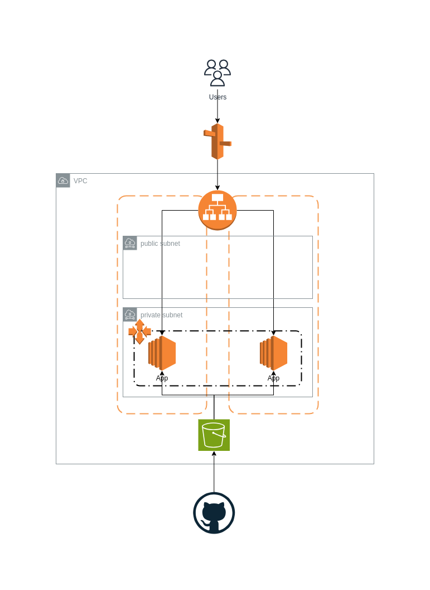

# Tilgungsplan

## Aufgabe

Entwickle ein Programm, das durch die Eingaben des Darlehensbetrages bei einem
festen Sollzins von 3% und einer anfänglichen jährlichen Tilgung von 2% einen Tilgungsplan
in Form einer tabellarischen Übersicht liefert.

## Lösung

Um die Aufgabe zu lösen wurde mittels Java 21, Spring Boot 3 und Thymeleaf eine Webanwendung entwickelt.
Diese stellt einfache Webseite bereit, um den Darlehensbetrag einzugeben und berechnet nach dem Übermitteln
der Daten den jährlichen Tilgungsplan.

### Extra Plugins

- JaCoCo -> Sicherstellen der Testabdeckung
- fmt-maven-plugin -> Formatierung des Codes nach [Google Java Style](https://google.github.io/styleguide/javaguide.html)
- micrometer & Spring Actuator -> Bereitstellung Information/Endpunkten zum Monitoring

## Deplyoment

### Elastic Beanstalk

